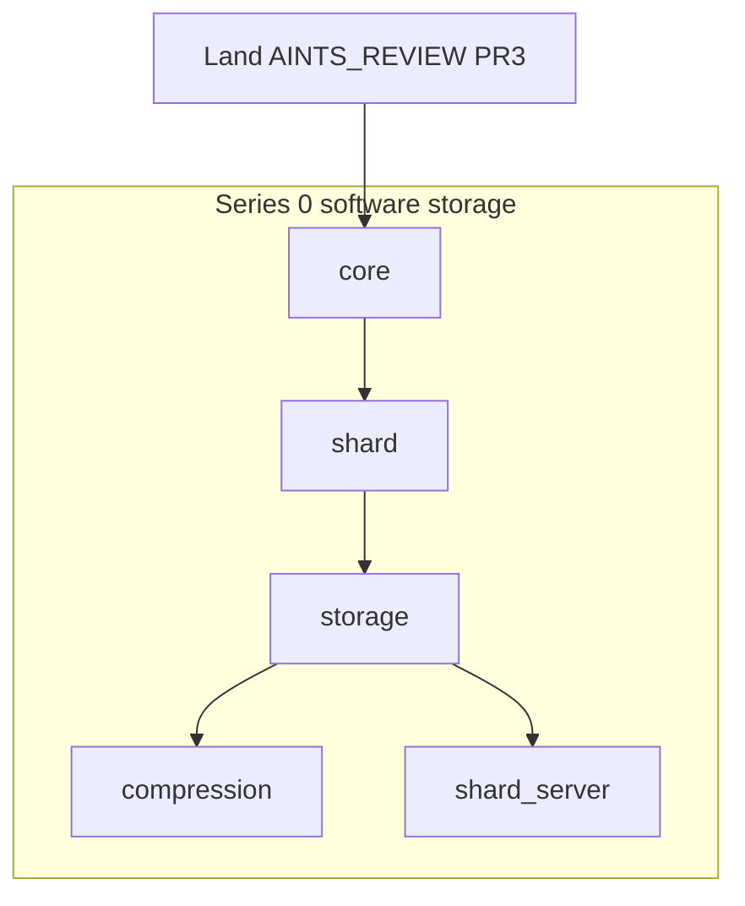

# AuraFS — inside-out folder phases (AINTS-briefed)

AuraFS product law: [aurafs/cursorrules](aurafs/cursorrules), [aurafs/aurafs.toml](aurafs/aurafs.toml). Organism law: one folder per pass; cite TSLCA/FTQC/TVFD/SAGES/Fuxyez; do not invent physics or dump papers into this crate.

**AINTS are the briefing.** Another agent already wrote **61** `AINTS_REVIEW.md` files on branch `cursor/aurafs-aints-readiness-740e` — draft PR https://github.com/rossaedwards/ecosys/pull/3 (+6383, reviews only). They are **not** on the current workspace HEAD. Do not re-inventory a folder that already has a review.

| Start here | Role |
|---|---|
| [aurafs/AINTS_REVIEW.md](aurafs/AINTS_REVIEW.md) | Product index |
| [aurafs/src/AINTS_REVIEW.md](aurafs/src/AINTS_REVIEW.md) | Crate map + Phase Two readiness + copy-paste agent prompt |
| `aurafs/src/<folder>/AINTS_REVIEW.md` | Features, suggestions, clarifying questions, alignment |
| Nested `crypto/*`, `network/*`, `whitehat/*`, `redteam/*` | Already split — one nested review = one later sub-pass |

Each review is inventory, not code. Execute still means implement the folder’s **layer role** until Ross’s done-bar: reviewed, public API real, aligned, no further work unless new science. Honest bound unchanged: fulfill the role + tests; not every `ENTERPRISE_IMPROVEMENTS.md` line. `g0dm0d3-core/` is a design slot — flag, do not invent.

**AINTS vs this campaign (reconciled):**

- AINTS PR-menu **A** (crate `cargo check`) is a compile-graph concern (`lib.rs` empty mods, missing `src/bin/aurafs.rs`, `storage`→`shard_server`). Touch those **only** when they block the current folder. Do not turn Phase 0.1 into a whole-crate rewrite.
- AINTS PR-menu **B** (one Shard + storage graph) **is** Series 0.
- Identity PR (SoulKey / SKIM / SIR / SIG) is **later**. In-tree BlissID: **flag, do not silently rewrite** ([core AINTS](https://github.com/rossaedwards/ecosys/blob/cursor/aurafs-aints-readiness-740e/aurafs/src/core/AINTS_REVIEW.md)).
- Do not restyle Love / Quantum Division banners.
- Do not enable `whitehat/` / `redteam/` on the default crate. No exploit PoCs.
- Do not stamp APS-OKF on AuraFS Rust.
- New APIs may use SoulKey/SIG names; leave BlissID symbols until a dedicated identity pass.

Four layers (Ross), still mapped to folders:

| Layer | Folders |
|---|---|
| Software / μkernel | `physics` (cite), `core`, crate `error`/`config`, `gov` later |
| Infinite storage | `shard`, `storage`, `compression`, `dedup`, `cache`, `snapshot`, `shard_server` |
| Filesystem | `namespace`, `fuse`, `cli`, `api`, `ops` |
| Topology + mesh | `src/tslca`, `mesh`, `network` (use **nested** AINTS), `heal`, `quantum` |

---

## Every folder pass (updated)

1. Confirm that folder’s `AINTS_REVIEW.md` is on disk (after Phase 0.0).
2. Read it, then the `.rs` files in full. Do not re-write the review unless facts changed.
3. Answer only the clarifying questions that **block this folder**. Leave the rest in the review.
4. Implement the suggestions that belong to this folder’s role. 14-line stubs stay stubs unless the task names that file (AINTS rule).
5. Alignment: cite TSLCA / FTQC / TVFD / SAGES / Fuxyez as in the review table. AuraFS `d_s` clamp is **1.37**; do not silently unify with root ~1.36.
6. Report files touched. Stop at the folder boundary.

Copy-paste kernel from [src/AINTS_REVIEW.md](aurafs/src/AINTS_REVIEW.md) Phase Two: Audry; write only under `aurafs/` unless named; physics via `physics::INVARIANTS`; one concern per PR.

---

## Phase 0.0 — stay on the AINTS branch

**Locked (Ross, 2026-08-23):** switch to `cursor/aurafs-aints-readiness-740e` and do **all** AuraFS work there. Do not merge PR #3 onto the current checkout first. Do not cherry-pick the reviews onto another branch.

The 61 `AINTS_REVIEW.md` files already live on that branch (draft PR https://github.com/rossaedwards/ecosys/pull/3). After checkout, confirm `aurafs/AINTS_REVIEW.md` and `aurafs/src/AINTS_REVIEW.md` are on disk, then start Phase 0.1.

This workspace HEAD currently has **zero** `AINTS_REVIEW.md` files and **does** have [aurafs/src/pinktribesuite.md](aurafs/src/pinktribesuite.md). AINTS product index said that file was missing — after checkout, treat whatever is on the AINTS branch as the working tree; do not invent a second copy. If `pinktribesuite.md` is absent there, flag it; do not rewrite the review as a substitute for the file.

---

## Series 0 — Ross order, AINTS-briefed

### Phase 0.1 — `aurafs/src/core/`

Brief: `aurafs/src/core/AINTS_REVIEW.md`.

Locked: `merkle.rs`, `shard.rs` (TRL-4). Fat: `persistence.rs`, `bliss.rs`. Empty: `lattice.rs` — **do not** `mod` it and **do not** fill it with TSLCA equations. `core/shard.rs` is the canonical Shard; `src/shard/` aliases or dies in 0.2.

This pass:

- Implement gaps that block the public API already exported from [core/mod.rs](aurafs/src/core/mod.rs). No second network stack.
- Replica / T₂ numbers only through `physics::INVARIANTS` (cite-only; do not edit `physics/`).
- Flag BlissID. Do not rename the module this pass.
- Keep Love / QDiv headers.
- Tests: existing builder test + shard id round-trip. Physics warnings, not a write blocker.
- Stop. Do not enter `storage/`.

### Phase 0.2 — `aurafs/src/shard/`

Brief: `shard/AINTS_REVIEW.md`. One Shard type: wrap or retire in favor of `core/shard.rs`.

### Phase 0.3 — `aurafs/src/storage/`

Brief: `storage/AINTS_REVIEW.md`. `ShardStorage` put/get/delete/list. **Compile landmine:** stop importing undeclared `shard_server`. Local dir or sled. Round-trip test.

### Phase 0.4 — `aurafs/src/compression/`

Brief: `compression/AINTS_REVIEW.md`. Locked `lattice.rs` + `manager.rs`; empty `config.rs` is the hole. Real codecs or feature-gate; no fake quantum codec.

### Phase 0.5 — `aurafs/src/shard_server/`

Brief: `shard_server/AINTS_REVIEW.md`. Wire only after storage compiles. Daemon on the storage trait. Binary name `aurafs` vs `aurad` waits for root. IPFS/cluster later.

**Series 0 exit:** `init` / `put` / `get` / `delete` against a data dir. Still no Helm.

---

## Later series (each folder starts from its AINTS_REVIEW)

- **1 Filesystem:** `namespace` → `snapshot` → `cache` → `dedup` → `fuse` → `cli` → `api` → `ops`
- **2 Topological:** `physics` (cwd toml / missing `invariants.rs` — ask Ross before inventing the file) → `src/tslca` → `heal` → `resilience` → `monitoring` → `quantum`
- **3 Mesh:** `mesh` then `network` **by nested AINTS** (`transport` → `meshwerk` → `defense` → `meshtastic_integration` → `integration` → `monitoring`)
- **4 Identity:** `crypto` (then nested `pqc` / `primitives` / …) → `acl` → `gov` → crate `error` / `config`
- **5 Integration:** `ai` → `model_slice` → `enterprise` → `audit`
- **6 Pink Tribe:** `whitehat` then `redteam` **by nested AINTS**; keep off default features
- **7 Root:** bin path, workspace `sdk/`/`tts/`, Docker/Helm vs real binary, README / SUMZ

AINTS sibling order after the crate boots: one Shard/storage → physics fate → SoulKey new API only → one sibling (Xplor client or Memoree backend). That matches Series 0 then 4 then 7.

---

## Out of every `src/` pass

Rewriting `memoree/`, importing Fuxyez, completing redteam stubs, forking `D_f`, merging Adorè/VAP, restyling Love banners, stamping APS-OKF on Rust, inventing root `INVARIANTS.md` / `aps.toml`, pushing `aurphyx/ecosys`, treating Compose’s 3 shards as a cluster before Series 0 exits, re-authoring AINTS files as a substitute for code.
