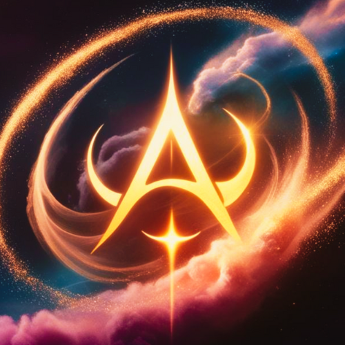
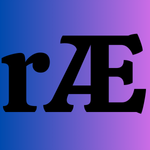

  

    

  

    

# AURPHYX LLC

### *Where Fractal Geometry Meets the Quantum Frontier*

   

  **Ross A. Edwards** — Father, Daddy, Architect, Researcher, & Founder

   

    

  <!-- ── Row 2: Connect ── -->
  
  
  
  
  

   

  <!-- ── Row 3: Status ── -->
  
  
  
  
  

---

| | |
|---|---|
| **Author** | Ross A. Edwards |
| **Affiliation** | Aurphyx LLC, Erie, PA |
| **Email** | [ross@aurphyx.org](mailto:ross@aurphyx.org) |
| **ORCiD** | [0009-0008-0539-1289](https://orcid.org/0009-0008-0539-1289) |
| **GitHub Personal** | [github.com/rossaedwards](https://github.com/rossaedwards) |
| **GitHub Org** | [github.com/Aurphyx](https://github.com/Aurphyx) |

---

## 🏛️ Aurphyx LLC

| | |
|---|---|
| **Website** | [aurphyx.com](https://aurphyx.com) |
| **Store** | [aurphyx.store](https://aurphyx.store) |
| **Discord** | [AurphyxHQ](https://discord.gg/aurphyx) |
| **Ko-Fi** | [ko-fi.com/aurphyx](https://ko-fi.com/aurphyx) |

---

  

   

  *"One soul, one voice, one vote. All paths lead to Equilibrium Manifold."*

   

  **© 2026 Ross A. Edwards | Aurphyx LLC | [ross@aurphyx.org](mailto:ross@aurphyx.org)**

