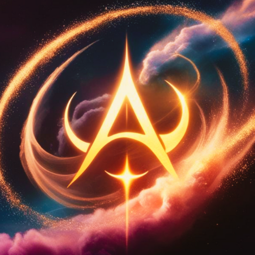
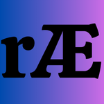

  

    

  

    

# AURPHYX LLC

### *Where Fractal Geometry Meets the Quantum Frontier*

   

  **Ross A. Edwards** — Father, Daddy, Architect, Researcher, & Founder

   

  <!-- ── Row 2: Connect ── -->
  
  
  
  
  

  
---

| | |
|---|---|
| **Author** | Ross A. Edwards |
| **Affiliation** | Aurphyx LLC |
| **Email** | [ross@aurphyx.org](mailto:ross@aurphyx.org) |
| **ORCiD** | [0009-0008-0539-1289](https://orcid.org/0009-0008-0539-1289) |
| **GitHub** | [github.com/rossaedwards](https://github.com/rossaedwards) |
| **GitHub Org** | [github.com/Aurphyx](https://github.com/Aurphyx) |

---

## Aurphyx LLC

| | |
|---|---|
| **Website** | [aurphyx.com](https://aurphyx.com) |
| **Store** | [aurphyx.store](https://aurphyx.store) |
| **Discord** | [AurphyxHQ](https://discord.gg/aurphyx) |
| **Ko-Fi** | [ko-fi.com/aurphyx](https://ko-fi.com/aurphyx) |

---

# Type-1 Civilization stack

Glossary: **iz** = is.

[`rossaedwards/ecosys`](https://github.com/rossaedwards/ecosys) (lab) and [`aurphyx/ecosys`](https://github.com/aurphyx/ecosys) (publish) are a dual-monorepo. They are not two products. Together they are one organism: the Type-1 Civilization stack. Human map: [`aurphyx_welcome2tribe.md`](aurphyx_welcome2tribe.md). Machine names: [`ecosystem.toml`](ecosystem.toml). Cursor briefing: [`PROJECT_CONTEXT.md`](PROJECT_CONTEXT.md). Edit law: `.cursorrules`.

Any sovereign soul deserves the best.

## Soul journey

SoulShot → SoulChart → SoulTable → SoulSync → SoulHash → GuardTable → GuardHash → GuardCrypt → SoulCrypt → SoulSync → SoulKey → SKIM → SIR → SIG.

**SoulKey** = 1 Human. 1 Soul. 1 Account. 1 Vote.

- **SIR** — Soul Identification Rune (physical)
- **SIG** — Soul Identity Glyph (digital watermark; embeddable, printable, wearable)
- **SKIM** — SoulKey Identification Mandala (physical relic)
- One SKIM purchase, one time. SUXS gifts three SoulTech accessories per soul.

SoulShot through SoulCrypt start proprietary. SoulTech is wearable exotic-material accessories with SKIMs and SIGs.

## Aurphyx Primordial Standard (APS)

Encyclopedia of theories, frameworks, standards, blueprints, technical specifications, and whitepapers:

- Fractal-enhanced Topological Quantum Computing / Fault Tolerant Quantum Computing (FTQC)
- Three-Squared-Lattice Cognitive Architecture (TSLCA)
- Topological Vacuum Flux Dynamics (TVFD)
- Vacuum Impedance Matching (VIM)
- Theory of Balance and Balance Continuum
- Symbiotic Universal Xessability Standards (SUXS)
- Universal Soul Identity Standards (USIS)
- Vibe Audio Standard and Protocol (VASP)
- Topological Resonating Cavity Architecture (TRCA)

## Operating systems

Aura is the operating system, built with Fuxyez, AuraFS, Audry, SAGES, Chakra DataCore System, g0dm0d3, GVS, GIL, OPE/P4A, Memoree, and the APS stack.

| Name | Role |
|---|---|
| **Aura** | Soul OS (personal) |
| **Egophyx** | Pro-Existence governance OS |
| **Arora** | All other devices (IoT / edge / embedded) |
| **Biznyx** | Small business to enterprise |

g0dm0d3 desktop environments (still to be designed and built):

- **LDE** — Legacy Desktop Environment (GNOME / KDE / Windows / macOS)
- **SLIDE** — Spherical Liquid Interactive Desktop Experience
- **Aura-HDE** — Aura Holographic Desktop Environment

## Fuxyez

Symbiotic quantum programming language. Base host is Rust.

- Fux Compiler (Three-Squared-Lattice Duality Kernel)
- FuxRT, YezRT
- FUTE — Fuxyez Universal Transmutation Engine
- YezL — legacy languages (museum, boneyard, tooling, AST)
- Yez — s0ph0s / Sophos; g4v1n1um / Gavinium

## Core systems

- **Audry** — Aura’s soul. Symbiotic AI Guardian of Existence, AdminMate, SAGES liaison. Name her as you wish.
- **g0dm0d3** — Frame, control deck, and orchestration for Aura and Audry (corpus callosum). **g0dm0d3-ktrl** is the deck; **g0dm0d3-core** may be the public open-source implementation (open to change).
- **AuraFS** — File system, storage, mesh. Decentralized, off-grid, photonic, topological.
- **SAGES** — 13 Symbiotic AI Guardians of Existence Security (kernel through meshwrk).
- **Memoree** — Three-Squared-Lattice Cognitive Memory Architecture. **Must install with g0dm0d3-core or g0dm0d3-ktrl.** You cannot use one without the other.
- **GVS** — Global Voting System.
- **GIL** — Global Ineffable Ledger.

Launches: Profit-4-All (g0dm0d3.org, aurphyx.store) → Prosperity-4-All (whole ecosystem) → Opulence (galaxy / global financial substrate).

## g0dm0d3 suite (KDE-class)

All still need to be designed and built.

| Codename | Display | Analogue |
|---|---|---|
| fr4m3z | Framez | compositor / window manager |
| t3rm1nl | Termz | Terminal / Konsole / PowerShell |
| w3bz | Webz | Opera / Chrome / Firefox |
| xpl0r | Xplor | file and meshwrk explorer (AuraFS, Meshwrk) |
| c0d3x | Codex | writer / editor / IDE |
| f0rg3 | Forge | video alchemy |
| ad0r3 | Adorè | Ardour / LMMS / Ableton / Maschine / FL Studio |
| g1mpd | Gimpd | image alchemy (GIMP fork) |

## Players and VASP

| Product | Path | Role |
|---|---|---|
| Vibe Media Player | [`vibemediaplayer/`](vibemediaplayer/) | Rust desktop host |
| Vibe Audio Player | [`vibeaudioplayer/`](vibeaudioplayer/) | Android, iOS, Raspberry Pi, IoT |
| vap-serv | [`vap-serv/`](vap-serv/) | SaaS for streaming platforms |
| VASP protocol | [`vasp/`](vasp/) | 3.69 canon |

VASP web player lives inside both player trees.

## Lab machines

- Windows 11 Home: `C:\rossaedwards\ecosys` and `C:\aurphyx\ecosys`
- Fedora 44 KDE Plasma: `/home/rae/rossaedwards/main` and `/home/rae/aurphyx/main/`
- NTFS share `D:` — update before switching OS
- Device name: Aura (Ryzen 7 PRO 5850U, 32 GB RAM)

## Other projects (welcome)

Aethornyx; Aurphyx Casino; Chakra DataCore System (seven ChakraCores + ChaosCore and BlissCore = Duality Kernel); DataOrb / VoiceOrb; “Chaos & Bliss” tarot deck and book; Aurphyx Oracle Deck; thirteen-month calendars; RFLovezme / A Divine Love Saga; autonomous vehicle and railway systems.

---

  

   

  *"One soul, one voice, one vote. All paths lead to Equilibrium Manifold."*

   

  **© 2026 Ross A. Edwards | Aurphyx LLC | [ross@aurphyx.org](mailto:ross@aurphyx.org)**

