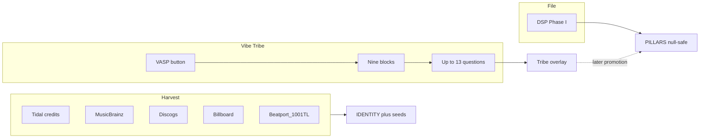

# Vibe Tribe Pillarz

VASP 3.69 voter copy. This file is copy and mappings only.

The VASP button is how the Vibe Tribe helps — more than a Like. Listener taps it, 3×3 lattice of nine blocks, taps a pillar, gets a short blunt questionnaire. Catalogs and DSP fill what they can first. The Tribe fills what only a body in a room can know.

No Tidal client, no vote database, no player chrome in this pass. Do not rewrite `VASP_Official Schema.md` or `VASP_Intro_Specs.md`. Do not invent pillar keys.

## Three layers (do not collapse)

1. **Harvest** — public catalogs / credits / charts. IDENTITY plus some pillar seeds. Unmeasured stay `null`.
2. **DSP / engine** — Phase I numbers from the file (kick ms, centroid, BPM).
3. **Tribe vote** — human answers. Land in a **Tribe overlay** first (`community_*` / running tallies). Do not silently extra-key the official `vap_object` until a later schema pass.

Dick Clark / Billboard / Discogs are ingestion sources. Aurphyx does not own those archives.

### Promotion (documented, not coded)

| Rule | |
| --- | --- |
| Where votes live | Overlay next to the profile: `tribe.overlay.<PILLAR>.<Qid>` with `choice`, `value`, `n`, `updated_at` |
| Numbers | Running mean |
| Enums | Mode |
| `EXPLICIT_FILTER` | Conservative max (Clean < Mild < Explicit < Severe) |
| Skip / E = N/A | Overlay stays `null` for that Q |
| Promote into `PILLARS` | Only in a later schema pass, and only if `n >= 13`, the leaf already exists on the official object, and a DSP-measured number is not overwritten |
| Never promote | Free-text notes, harvest hints, Camelot mixability, “gym-legal” flags — overlay only |

## Harvest map (baseline before a click)

| Source | What it is allowed to seed | Pillars it may hint |
| --- | --- | --- |
| Tidal artist/album/track credits | TITLE, ARTIST, ISRC, engineers, performers | TIMBRAL (studio lineage), GENEALOGICAL (credits) |
| MusicBrainz | MBID, duration, release date, recording fingerprint | GENEALOGICAL.ERA_ANCHORING, IDENTITY |
| Discogs | Label, catalog no., vinyl matrix, pressing region | GENEALOGICAL |
| Billboard / charts | Peak, weeks, market | CONTEXTUAL + GENEALOGICAL.VIRAL_VELOCITY (hint only) |
| Beatport / Traxsource | BPM, Camelot, EDM subgenre | TONAL, STRUCTURAL.BPM, GENEALOGICAL.GENRE_TREE |
| 1001Tracklists / SoundCloud comments | Set context, festival/club mentions | CONTEXTUAL |
| DSP (already in VMP) | Kick, syncopation, centroid, etc. | STRUCTURAL, TONAL, TIMBRAL |

TIDAL consent app name stays **Vibe Audio Player**. No API keys in git. Spotify audio-features is not a dependency.

## UI contract (spec only)

- VASP button on now-playing (VMP and VAP).
- Opens 3×3 overlay: pillars 1–9 in protocol order (STRUCTURAL … GENEALOGICAL).
- One pillar page: title = `PILLAR N: KEY` + archetype (The Body, etc.).
- Up to 13 questions. One submit per question is valid. Skip is allowed.
- Answers A–D (sometimes E = instrumental / N/A).
- Voice: you / your body / your night. One job per question. Lived options, not academic labels. System mapping sits in the target column, not in the question.
- Pillar 4 safety stays blunt without a slur dump. Instrumental tracks short-circuit Linguistic at Q10.

Gold-standard sentence (locked): **How would you dance with a sexy person of interest to this??**

---

## 1 STRUCTURAL — The Skeleton

**P1-Q01** Does the beat drop like a brick, punch you in the chest, or slowly creep up on you??  
→ `PERCUSSIVE_DNA.KICK_TRANSIENT.PROFILE` · A brick · B punch · C creep · D never drops

**P1-Q02** Kick hit: click, thud, or an 808 that won’t die??  
→ `KICK_TRANSIENT.ATTACK` / `DECAY` · A click · B thud · C boom-sub · D can’t tell

**P1-Q03** Is this marching you, swinging you, or making you miss the 1 on purpose??  
→ `SYNCOPATION_INDEX` · A march · B swing · C polyrhythm trap · D drunk

**P1-Q04** Locked to a grid, or off the click like it had a drink??  
→ `GROOVE_QUANTIZATION` · A machine lock · B tight human · C swung late · D off the click

**P1-Q05** Count it. Club 4/4, waltz, or odd-meter that shouldn’t work??  
→ `TIME_SIGNATURE` · A 4/4 · B 3/4 · C odd · D can’t find 1

**P1-Q06** How fast does your body think this is??  
→ `BPM_PERCEIVED` · A crawl · B walk · C run · D flee

**P1-Q07** Could a DJ mix out in 8 bars, or you ride the whole damn thing??  
→ `MIX_WINDOW_INDEX` · A 8-bar runway · B a few bars · C tight · D ride it all

**P1-Q08** When it strips down, how naked does it get??  
→ `BREAKDOWN_DEPTH` · A still dressed · B underwear · C skin · D bone

**P1-Q09** Ghost notes whispering, or every drum screaming equally??  
→ `GHOST_NOTE_DENSITY` · A none · B whisper · C busy pocket · D all equal scream

**P1-Q10** Verse-chorus highway, or one long tunnel with no signs??  
→ `SECTIONAL_MARKERS` · A highway · B a few signs · C one tunnel · D no signs

**P1-Q11** First 8 bars: whole plot, or a lie until the drop??  
→ overlay `sectional_open` · A whole plot · B fair warning · C lie until the drop · D no drop

**P1-Q12** Low end: heartbeat, punch, or a floor you fall through??  
→ `KICK_TRANSIENT.PROFILE` · A heartbeat · B punch · C floor-fall · D no low end

**P1-Q13** If this were a skeleton: titanium, wet bone, or still growing??  
→ overlay `architecture` · A titanium · B wet bone · C still growing · D no skeleton

---

## 2 TONAL — The Flesh

**P2-Q01** Melody: pretty on purpose, or dark and tense like it knows something??  
→ `DISSONANCE_RATING` · A pretty on purpose · B bittersweet · C dark/tense · D ugly on purpose

**P2-Q02** Does it feel major-sun, minor-night, or modal and untrustworthy??  
→ `KEY_SIGNATURE` (felt) · A major-sun · B minor-night · C modal · D both fighting

**P2-Q03** Hook: stuck in your teeth, or gone when the song is??  
→ `HOOK_STRENGTH` · A stuck · B catchy · C grows · D gone when it ends

**P2-Q04** Chords: three-chord punch, jazz maze, or one drone forever??  
→ `CHORD_COMPLEXITY` · A three-chord · B 7ths · C jazz maze · D one drone

**P2-Q05** Tune walking next door, or leaping off the roof??  
→ `MELODIC_MOTION` · A walk · B mix · C leap · D no tune

**P2-Q06** Melody range: whisper-small, or huge enough to hurt??  
→ `RANGE_SPAN` · A whisper-small · B one octave · C wide · D hurts

**P2-Q07** Would you mix this in Camelot, or would it clash on purpose??  
→ overlay `camelot_mix` (Beatport may seed) · A mix it · B if you care · C clash on purpose · D don’t

**P2-Q08** Notes sitting on the piano, or sliding between them??  
→ `MICROTONALITY` · A on the piano · B bends · C between the keys · D can’t tell

**P2-Q09** Feel 440-normal, or tuned like a different planet??  
→ `REFERENCE_PITCH` · A 440-normal · B a hair flat · C a hair sharp · D different planet

**P2-Q10** Harmony hugging you, or holding a knife behind its back??  
→ `DISSONANCE_RATING` · A hug · B warm with an edge · C knife · D already cut

**P2-Q11** Bass: floor, or the actual hook??  
→ overlay `bass_role` · A floor · B both · C the hook · D missing

**P2-Q12** Who owns the tune: voice, synth, guitar, or nobody??  
→ overlay `contour_source` · A voice · B synth · C guitar · D nobody

**P2-Q13** Scale diet: pentatonic comfort food, chromatic chaos, or church modes??  
→ `HARMONIC_PROFILE` · A pentatonic · B church modes · C chromatic chaos · D no scale

---

## 3 TIMBRAL — The Skin

**P3-Q01** Clean and airy, warm like vinyl, or raw and gritty??  
→ `TEXTURE_GRAIN.SURFACE` / `FIDELITY_SCORE` · A clean airy · B warm vinyl · C raw grit · D blown-out

**P3-Q02** Dark and muddy, warm body, or bright enough to cut glass??  
→ `SPECTRAL_CENTROID` · A dark/muddy · B warm body · C bright · D cut glass

**P3-Q03** Sub: polite, present, or rearranging your organs??  
→ `SUB_DOMINANT` · A polite · B present · C heavy · D organs

**P3-Q04** Mids in your face, or scooped like a 2010s club mix??  
→ `MID_FORWARD` · A in your face · B balanced · C scooped · D no mids

**P3-Q05** Air on top: silk, ice, or none??  
→ `AIR_BRILLIANCE` · A silk · B ice · C a little · D none

**P3-Q06** Bedroom demo, radio-squash, or studio you could eat??  
→ `FIDELITY_SCORE` · A bedroom · B radio-squash · C studio you could eat · D sterile loud

**P3-Q07** Stereo: mono punch, normal, or widescreen IMAX??  
→ `SPATIAL_WIDTH` · A mono punch · B normal · C wide · D IMAX

**P3-Q08** Dynamics breathing, or brickwalled into a square??  
→ `DYNAMIC_RANGE_LRA` · A breathing · B normal · C loud · D brick wall

**P3-Q09** Grain: plastic, wood, metal, skin??  
→ `SURFACE` · A plastic · B wood · C metal · D skin

**P3-Q10** Hear tape, bitcrush, vinyl crackle — or too clean to be true??  
→ `ARTIFACTS` · A too clean · B vinyl · C tape · D bitcrush/glitch

**P3-Q11** Saturation: none, honey, or on fire??  
→ `SPECTRAL_SATURATION` · A none · B honey · C thick · D on fire

**P3-Q12** This skin belong in a club, a car, or headphones at 2am??  
→ overlay `translate` · A club · B car · C 2am headphones · D nowhere honest

**P3-Q13** Would you call this expensive, cheap on purpose, or broken??  
→ `FIDELITY_SCORE` / grain · A expensive · B honest mid · C cheap on purpose · D broken

---

## 4 LINGUISTIC — The Voice

**P4-Q01** How hard is the message: poetry, fire, or a raw story they shouldn’t have told??  
→ `DELIVERY_STYLE` / `NARRATIVE_ARC` · A poetry · B fire · C raw story · D no words

**P4-Q02** Could you play this with your mom in the car??  
→ `EXPLICIT_FILTER` · A Clean · B Mild · C Explicit · D Severe

**P4-Q03** Delivery: singing, rapping, screaming, talking, or chopped??  
→ `DELIVERY_STYLE` · A singing · B rapping/talking · C screaming · D chopped

**P4-Q04** Voice: whisper in your ear, or belt that moves furniture??  
→ `POSITION` · A whisper · B in the room · C belt · D buried

**P4-Q05** Dry as a live mic, or processed into a cathedral / autotune armor??  
→ `PROCESSING` · A dry · B tasteful · C cathedral/autotune · D destroyed

**P4-Q06** Does the lyric go somewhere, or loop one feeling??  
→ `NARRATIVE_ARC` · A goes somewhere · B scenes · C one-feeling loop · D abstract

**P4-Q07** What’s it actually about, no poetry: sex, God, money, grief, flex, nothing??  
→ `TOPIC_CLUSTERS` · A sex/want · B God/grief · C money/flex · D nothing/other

**P4-Q08** Language you speak, language you feel, or who cares??  
→ `PRIMARY_LANGUAGE` · A I speak it · B I feel it · C mix · D who cares

**P4-Q09** Slang from a real block, or tourist-talk??  
→ `DIALECT_SLANG` · A real block · B scene slang · C tourist-talk · D none

**P4-Q10** Instrumental / no words — skip the rest??  
→ N/A short-circuit · A no words, stop here · B a few words · C full lyric · E N/A

**P4-Q11** Call-and-response, or one person talking at you??  
→ overlay `lyric_social` · A call-and-response · B one person · C a crowd · D no voice

**P4-Q12** Who is “you” in this song: lover, enemy, God, the mirror??  
→ overlay `addressee` · A lover · B enemy · C God · D the mirror

**P4-Q13** Kids in the room: absolutely not, maybe the radio edit, or it’s a lullaby??  
→ `EXPLICIT_FILTER` + topic · A lullaby · B radio edit maybe · C absolutely not · D especially not

---

## 5 AFFECTIVE — The Heart

**P5-Q01** Where does this instantly take your head: euphoria, melancholy, rage, or pure focus??  
→ `THAYER_COORDINATES` · A euphoria · B melancholy · C rage · D pure focus

**P5-Q02** After 30 seconds, are you lighter or heavier??  
→ `VALENCE` · A lighter · B same · C heavier · D wrecked

**P5-Q03** Heart rate: still, walking, sprinting, or panic??  
→ `AROUSAL` · A still · B walking · C sprinting · D panic

**P5-Q04** Does it make you feel in charge, or owned??  
→ `DOMINANCE` · A in charge · B even · C owned · D small

**P5-Q05** Mood: one color the whole time, or it flips on you??  
→ `MOOD_STABILITY` · A one color · B drift · C flips · D volatile

**P5-Q06** Cry it out, or bottle it??  
→ `CATHARSIS_POTENTIAL` · A cry it out · B if you’re close · C bottle it · D it bottles you

**P5-Q07** Does this smell like a year you survived??  
→ `NOSTALGIA_TRIGGER` · A yes · B a little · C now · D outside of time

**P5-Q08** Build: slow burn, sudden slap, or already at 11??  
→ `BUILD_UP_VELOCITY` · A no build · B slow burn · C sudden slap · D already 11

**P5-Q09** Ending: resolved, cliff, or fake-out??  
→ `RESOLUTION_STATE` · A resolved · B soft · C cliff · D fake-out

**P5-Q10** When it stops, what’s left in your chest??  
→ overlay `residue` · A lift · B ache · C static · D nothing

**P5-Q11** Honest: cry, fight, fuck, or work??  
→ Thayer blunt map · A cry · B fight · C fuck · D work

**P5-Q12** Safe song, or dangerous to be alone with??  
→ overlay `alone_safe` · A holds you · B depends · C risky · D not tonight

**P5-Q13** Lonely heart or crowded heart??  
→ overlay `social_affect` · A lonely · B two · C crowded · D empty room

---

## 6 CONTEXTUAL — The Scene

**P6-Q01** Absolute best place to run this??  
→ `MACRO_SETTING` · A late-night drive · B rain · C gym · D sunny festival

**P6-Q02** Room: bedroom, club, car, church, warehouse??  
→ `MACRO_SETTING` · A bedroom · B club/warehouse · C car · D church/other

**P6-Q03** What are you doing: driving, lifting, kissing, cleaning, nothing??  
→ `MICRO_ACTIVITY` · A driving · B lifting/dancing · C kissing · D cleaning/nothing

**P6-Q04** Alone, with one person, your crew, or strangers??  
→ `SOCIAL_SETTING` · A alone · B one person · C crew · D strangers

**P6-Q05** Clock: dawn, workday, dusk, 3am??  
→ `TIME_OF_DAY` · A dawn · B workday · C dusk · D 3am

**P6-Q06** Weather this demands: clear, rain, storm, doesn’t matter??  
→ `WEATHER` · A clear · B rain · C storm · D doesn’t matter

**P6-Q07** Temperature: cold neon, sweat, or AC??  
→ `TEMPERATURE` · A cold neon · B AC · C warm · D sweat

**P6-Q08** Job of the track: hype, heal, seduce, focus, wreck??  
→ `FUNCTIONAL_GOAL` · A hype · B heal/focus · C seduce · D wreck

**P6-Q09** Billboard-peak energy, or never-charted on purpose??  
→ overlay harvest hint · A chart energy · B could chart · C never-charted on purpose · D don’t know

**P6-Q10** Festival main stage, or basement that isn’t on a map??  
→ overlay `stage` · A main stage · B side stage · C basement · D not a stage song

**P6-Q11** Headphones world, or speakers that annoy the neighbors??  
→ overlay `playback` · A headphones · B car · C house speakers · D neighbors hate it

**P6-Q12** Comedown / aftercare, or only the peak??  
→ `TIME_OF_DAY` / `FUNCTIONAL_GOAL` · A aftercare · B either · C peak only · D neither

**P6-Q13** Would you put this on a first date, a last night, or neither??  
→ `SOCIAL_SETTING` / intent · A first date · B last night · C both · D neither

---

## 7 PHOTOMETRIC — The Eye

Named colors write hex in the overlay only until promotion.

**P7-Q01** You’re on lasers at the festival. Dominant color??  
→ `PRIMARY_HEX` · A crimson `#C41E3A` · B cobalt `#1B3B6F` · C gold `#C9A227` · D void `#5B2C6F`

**P7-Q02** Second color in the room??  
→ `SECONDARY_HEX` · A white `#F5F5F5` · B acid `#39FF14` · C amber `#FF8C00` · D none

**P7-Q03** Palette: ice, blood, gold, void??  
→ `PALETTE_TEMPERATURE` · A ice · B blood · C gold · D void

**P7-Q04** Floor brightness: blackout, club dim, daylight??  
→ `BRIGHTNESS_FLOOR` · A blackout · B club dim · C room-on · D daylight

**P7-Q05** Peaks: still dim, or retina-burn??  
→ `BRIGHTNESS_CEILING` · A still dim · B club peak · C retina-burn · D daylight

**P7-Q06** Strobe: none, tasteful, seizure warning??  
→ `STROBE_TRIGGER` · A none · B drop only · C tasteful · D warning

**P7-Q07** Lights: snap, or melt??  
→ `FADE_RATE` · A snap · B fast fade · C melt · D always breathing

**P7-Q08** Fog: none, club haze, can’t see your hands??  
→ `FOG_DENSITY` · A none · B haze · C thick · D can’t see hands

**P7-Q09** Lasers even make sense, or this is a candle song??  
→ `LASER_COMPATIBILITY` · A lasers · B some beams · C no · D candle song

**P7-Q10** Visual noise: clean beams, or static and glitch??  
→ `VISUAL_NOISE` · A clean · B grain · C glitch · D snow

**P7-Q11** AuraOrb on your desk: pulse, swirl, or sit still??  
→ overlay lumen · A pulse · B swirl · C sit still · D flicker

**P7-Q12** Blackout on the drop, or lights are the drop??  
→ `STROBE_TRIGGER` / floor · A blackout · B lights are the drop · C both · D neither

**P7-Q13** UV, infrared-red, or full rainbow mess??  
→ `CHROMATIC_MAP` · A UV · B infrared-red · C gold/white · D rainbow mess

---

## 8 KINETIC — The Body

**P8-Q01** How would you dance with a sexy person of interest to this??  
→ `MOTOR_RESPONSE` + overlay MET · A Slow grind / close contact · B Fast shuffling / energetic · C Headbobbing / chill sway · D Moshpit / high intensity

**P8-Q02** Head: statue, nod, or whipping??  
→ `HEAD_NOD` · A statue · B nod · C constant · D whipping

**P8-Q03** Hips: locked, figure-8, or gone??  
→ `SWAY` · A locked · B a little · C figure-8 · D gone

**P8-Q04** Feet: planted, bounce, or running in place??  
→ `DRIVE` · A planted · B bounce · C walk · D running in place

**P8-Q05** Workout truth: stretch, walk, HIIT, or you’ll die??  
→ `MET_SCORE` · A stretch · B walk · C HIIT · D you’ll die

**P8-Q06** Heart zone this wants: rest, fat-burn, cardio, redline??  
→ `TARGET_HR_ZONE` · A rest · B fat-burn · C cardio · D redline

**P8-Q07** Breathing: yoga, talking, gasping??  
→ `BREATH_RATE` · A yoga · B talking · C dance-breath · D gasping

**P8-Q08** Nervous system: soothed, or spiked??  
→ `HRV_IMPACT` · A soothed · B neutral · C spiked · D clenched

**P8-Q09** Hands: down, up, on them, or fists??  
→ overlay motor · A down · B up · C on them · D fists

**P8-Q10** Couple dance, circle pit, or nobody touches??  
→ overlay `social_kinetic` · A couple · B bounce near · C nobody touches · D circle pit

**P8-Q11** Drop hits: freeze, jump, or grind harder??  
→ `DRIVE` / MET · A freeze · B jump · C grind harder · D no drop

**P8-Q12** Could you sit still? Lie.  
→ `DRIVE` · A yes · B I’m lying · C no · D already standing

**P8-Q13** After the last bar, are you still moving??  
→ overlay residual MET · A stopped · B still swaying · C still going · D can’t stop

P8-Q01 MET seeds (overlay only): A ~2.8 · B ~6.5 · C ~1.8 · D ~8.5

---

## 9 GENEALOGICAL — The Roots

**P9-Q01** True to its roots, or trying to go mainstream??  
→ `AUTHENTICITY_SCORE` · A bone-true · B mostly · C crossover · D costume

**P9-Q02** What tribe is this actually for??  
→ `SUBCULTURE_ID` · A metal · B EDM · C hip-hop · D pop/country/other

**P9-Q03** Would the old heads nod, or call it a poser??  
→ `AUTHENTICITY_SCORE` · A nod · B argue · C side-eye · D poser

**P9-Q04** What year does your soul think this came from??  
→ `CULTURAL_ERA` · A now · B 2010s · C 90s–00s · D older/future

**P9-Q05** Timeless, or timestamped to a TikTok week??  
→ `TIMELESSNESS_SCORE` · A timestamped · B of its week · C walks around · D timeless

**P9-Q06** You heard this sample / interpolation before??  
→ `SAMPLE_LINEAGE` / `INTERPOLATION` · A obvious sample · B interpolation I can name · C maybe · D original

**P9-Q07** Genre tree: one root, or a mutt on purpose??  
→ `GENRE_TREE` · A one root · B clear branch · C mutt on purpose · D no tree

**P9-Q08** Spreading quiet, or already everywhere??  
→ `VIRAL_VELOCITY` · A already everywhere · B spreading · C quiet · D will not trend

**P9-Q09** Vinyl-nerd track, or never existed on wax??  
→ overlay Discogs hint · A wax in the blood · B both · C digital native · D never wax

**P9-Q10** Who do you play this at to prove you know??  
→ `SUBCULTURE_ID` · A heads · B the club · C everybody · D nobody — it’s mine

**P9-Q11** Cover energy, original spirit, or neither??  
→ overlay DNA · A original spirit · B interpolation · C cover energy · D neither

**P9-Q12** Chart candy, or underground on purpose??  
→ overlay authenticity vs viral · A underground on purpose · B both · C chart candy · D don’t know

**P9-Q13** Gatekeep it, or send it to everybody??  
→ `TRIBE_ALIGNMENT` · A gatekeep · B my people · C send it · D already public

---

## Out of scope this pass

- Player UI / 3×3 overlay in VMP or VAP
- Tidal / MusicBrainz / Discogs clients or keys
- Vote-tally engine
- Changing VASP 3.69 required keys
- Merging other product skins into this file

117 cells. Skip is valid. One Q is valid. Overlay first.
