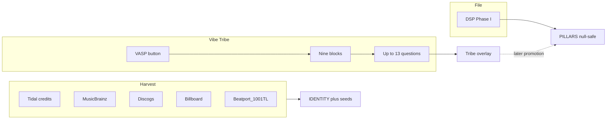

# Vibe Tribe Pillarz

<<<<<<< HEAD
**VASP 3.69 voter copy** · Aurphyx LLC · Accessibility = Xessability

The VASP button is how the Vibe Tribe contributes. It is more than Like / Fav / Love. Listener taps it, gets the 3×3 lattice of nine blocks, taps a pillar, answers a short blunt questionnaire. Catalogs and DSP fill what they can first. The Tribe fills what only a body in a room can know.

This file is **copy and mappings**. It does not change [VASP_Official Schema.md](VASP_Official%20Schema.md) or [VASP_Intro_Specs.md](VASP_Intro_Specs.md). It does not add pillar keys.

Players that will host the button: Vibe Media Player (`vibeplayer/`) and Vibe Audio Player (`vibeaudioplayer/`).

## Three layers (do not collapse)

1. **Harvest** — public catalogs, credits, charts. Seeds `IDENTITY` and some pillar hints. Unmeasured stay `null`.
2. **DSP / engine** — Phase I numbers from the file (kick ms, centroid, BPM). See [VASP_Logic Architecture.md](VASP_Logic%20Architecture.md).
3. **Tribe vote** — human answers. Land in a **Tribe overlay** first. Do not extra-key the official `vap_object` until a later schema pass.

Dick Clark archives, Billboard, Discogs, MusicBrainz, Tidal, Beatport, and the rest are **ingestion sources**. Aurphyx does not own those archives.

## Tribe overlay vs official PILLARS

Votes write `community_*` tallies in a sidecar overlay (player cache / future `vap.tribe.json`). Official `PILLARS` stay DSP + harvest until **promotion**.

Promotion (documented, not coded here): a field may graduate from overlay into `PILLARS` only when (a) the schema already has that field, (b) sample size is enough to be honest, (c) DSP has not already measured a contradictory physical number. Unmeasured remains `null`. Do not mark a field known to satisfy the UI.

## Harvest map (baseline before a click)

| Source | What it may seed | Pillars it may hint |
| --- | --- | --- |
| Tidal artist / album / track credits | `TITLE`, `ARTIST`, ISRC, engineers, performers | TIMBRAL (studio lineage), GENEALOGICAL (credits) |
| MusicBrainz | MBID, duration, release date, recording fingerprint | GENEALOGICAL.ERA_ANCHORING, IDENTITY |
| Discogs | Label, catalog no., vinyl matrix, pressing region | GENEALOGICAL |
| Billboard / charts | Peak, weeks, market | CONTEXTUAL; GENEALOGICAL.VIRAL_VELOCITY (hint only) |
| Beatport / Traxsource | BPM, Camelot, EDM subgenre | TONAL, STRUCTURAL BPM, GENEALOGICAL.GENRE_TREE |
| 1001Tracklists / SoundCloud comments | Set context, festival / club mentions | CONTEXTUAL |
| DSP (VMP) | Kick, syncopation, centroid, and other Phase I | STRUCTURAL, TONAL, TIMBRAL |

TIDAL consent app name is **Vibe Audio Player**. No API keys in git. Spotify audio-features is not a dependency.

## UI contract (spec; not built in this file)

- VASP button on now-playing (VMP and VAP).
- Opens a 3×3 overlay: pillars 1–9 in protocol order (STRUCTURAL … GENEALOGICAL).
- One pillar page: title `PILLAR N: KEY` plus archetype (The Skeleton, The Flesh, …).
- Up to **13** questions per pillar. One submit per question is valid. Skip leaves that overlay slot null. Nobody has to finish all 13.
- Answers are A–D. Some questions add E = instrumental / N/A.
- Question voice is second person, blunt, personal. Gold standard (locked):

> How would you dance with a sexy person of interest to this??

- Corporate metric names (`dissonance density`, `MET score`) live in the **system** column, never in the prompt.

## Voice rules

- You / your body / your night. Not “the user.”
- One job per question. One schema field, or one tight cluster.
- Options are lived, not academic.
- Pillar 4 explicit / safety stays blunt without a slur dump.
- Instrumental tracks: Linguistic Q10 short-circuits the rest of that pillar.

## Nine pillars

| Pillar | Canonical key | Archetype |
| ---: | --- | --- |
| 1 | STRUCTURAL | The Skeleton |
| 2 | TONAL | The Flesh |
| 3 | TIMBRAL | The Skin |
| 4 | LINGUISTIC | The Voice |
| 5 | AFFECTIVE | The Heart |
| 6 | CONTEXTUAL | The Scene |
| 7 | PHOTOMETRIC | The Eye |
| 8 | KINETIC | The Body |
| 9 | GENEALOGICAL | The Roots |

---

## Pillar 1 — STRUCTURAL (The Skeleton)

### Q1 — Drop

Does the beat drop like a brick, punch you in the chest, or slowly creep up on you??

- System: `PILLARS.STRUCTURAL.PERCUSSIVE_DNA.KICK_TRANSIENT.PROFILE`
- A Brick
- B Punch
- C Creep
- D Never drops

### Q2 — Kick hit

Kick hit: click, thud, or an 808 that won’t die??

- System: `KICK_TRANSIENT.ATTACK` / `DECAY`
- A Click
- B Thud
- C Boom-sub
- D Can’t tell

### Q3 — Syncopation

Is this marching you, swinging you, or making you miss the 1 on purpose??

- System: `PERCUSSIVE_DNA.SYNCOPATION_INDEX`
- A March
- B Swing
- C Polyrhythm trap
- D Drunk

### Q4 — Grid

Locked to a grid, or off the click like it had a drink??

- System: `TEMPORAL_DYNAMICS.GROOVE_QUANTIZATION`
- A Nailed to the grid
- B Human, still on time
- C Drunk off the click
- D No click exists

### Q5 — Meter

Count it. Club 4/4, waltz, or odd-meter that shouldn’t work??

- System: `TEMPORAL_DYNAMICS.TIME_SIGNATURE`
- A Club 4/4
- B Waltz / 3
- C Odd-meter that shouldn’t work
- D I lose the count

### Q6 — Body tempo

How fast does your *body* think this is??

- System: `TEMPORAL_DYNAMICS.BPM_PERCEIVED`
- A Crawl
- B Walk
- C Run
- D Flee

### Q7 — Mix window

Could a DJ mix out in 8 bars, or you ride the whole damn thing??

- System: `ARRANGEMENT_ARCHITECTURE.MIX_WINDOW_INDEX`
- A Mix out in 8
- B Need 16–32
- C Ride the whole damn thing
- D No mix, only a cut

### Q8 — Breakdown

When it strips down, how naked does it get??

- System: `ARRANGEMENT_ARCHITECTURE.BREAKDOWN_DEPTH`
- A Still dressed
- B Underwear
- C Skin
- D Bone

### Q9 — Ghost notes

Ghost notes whispering, or every drum screaming equally??

- System: `PERCUSSIVE_DNA.GHOST_NOTE_DENSITY`
- A Ghosts everywhere
- B A few whispers
- C Every drum screaming equally
- D Barely any drums

### Q10 — Form

Verse-chorus highway, or one long tunnel with no signs??

- System: `ARRANGEMENT_ARCHITECTURE.SECTIONAL_MARKERS`
- A Verse-chorus highway
- B Build / drop / break
- C One long tunnel, no signs
- D Collage / through-composed

### Q11 — Opening lie

First 8 bars: whole plot, or a lie until the drop??

- System: `SECTIONAL_MARKERS` (intro honesty)
- A Whole plot in 8
- B Hint, then the real song
- C Lie until the drop
- D No drop, no plot, just weather

### Q12 — Low end

Low end: heartbeat, punch, or a floor you fall through??

- System: `KICK_TRANSIENT.PROFILE`
- A Heartbeat
- B Punch
- C Floor you fall through
- D Thin / no low end

### Q13 — Skeleton

If this were a skeleton: titanium, wet bone, or still growing??

- System: overall STRUCTURAL architecture (overlay until promotion)
- A Titanium
- B Wet bone
- C Still growing
- D Already dust

---

## Pillar 2 — TONAL (The Flesh)

### Q1 — Melody weather

Melody: pretty on purpose, or dark and tense like it knows something??

- System: `HARMONIC_PROFILE.DISSONANCE_RATING`
- A Pretty on purpose
- B Dark and tense
- C Both, switching
- D No melody, just pressure

### Q2 — Felt key

Does it feel major-sun, minor-night, or modal and untrustworthy??

- System: `HARMONIC_PROFILE.KEY_SIGNATURE` (felt, not theory class)
- A Major-sun
- B Minor-night
- C Modal and untrustworthy
- D Changes on me

### Q3 — Hook

Hook: stuck in your teeth, or gone when the song is??

- System: `MELODIC_CONTOUR.HOOK_STRENGTH`
- A Stuck in your teeth
- B There, then gone
- C Gone when the song is
- D Never had a hook

### Q4 — Chords

Chords: three-chord punch, jazz maze, or one drone forever??

- System: `HARMONIC_PROFILE.CHORD_COMPLEXITY`
- A Three-chord punch
- B Jazz maze
- C One drone forever
- D Can’t hear chords

### Q5 — Motion

Tune walking next door, or leaping off the roof??

- System: `MELODIC_CONTOUR.MELODIC_MOTION`
- A Walking next door
- B Leaping off the roof
- C Sitting still
- D Sliding, not stepping

### Q6 — Range

Melody range: whisper-small, or huge enough to hurt??

- System: `MELODIC_CONTOUR.RANGE_SPAN`
- A Whisper-small
- B Normal talking range
- C Huge enough to hurt
- D All over the place

### Q7 — Camelot

Would you mix this in Camelot, or would it clash on purpose??

- System: Tribe overlay (Beatport/Traxsource may seed key/BPM; not a 3.69 key)
- A Mixes clean
- B Mixes if you’re careful
- C Clashes on purpose
- D I don’t mix

### Q8 — Between the notes

Notes sitting on the piano, or sliding between them??

- System: `TUNING_STANDARD.MICROTONALITY`
- A On the piano
- B Sliding between
- C Bent and broken
- D Can’t tell

### Q9 — Tuning world

Feel 440-normal, or tuned like a different planet??

- System: `TUNING_STANDARD.REFERENCE_PITCH`
- A 440-normal
- B Different planet
- C Tape-wobble world
- D Don’t care / don’t hear it

### Q10 — Harmony intent

Harmony hugging you, or holding a knife behind its back??

- System: `DISSONANCE_RATING` / tension
- A Hugging you
- B Knife behind its back
- C Both
- D No harmony, just a line

### Q11 — Bass job

Bass: floor, or the actual hook??

- System: overlay on melodic vs foundation (TONAL contour + STRUCTURAL low end)
- A Floor
- B The actual hook
- C Both, trading
- D Bass is missing

### Q12 — Who owns the tune

Who owns the tune: voice, synth, guitar, or nobody??

- System: `MELODIC_CONTOUR` source (overlay)
- A Voice
- B Synth
- C Guitar / acoustic
- D Nobody / the drums

### Q13 — Scale diet

Scale diet: pentatonic comfort food, chromatic chaos, or church modes??

- System: `HARMONIC_PROFILE`
- A Pentatonic comfort food
- B Chromatic chaos
- C Church modes
- D Blues / other dirt

---

## Pillar 3 — TIMBRAL (The Skin)

### Q1 — Surface

Clean and airy, warm like vinyl, or raw and gritty??

- System: `TEXTURE_GRAIN.SURFACE` / `PRODUCTION_AESTHETIC.FIDELITY_SCORE`
- A Clean and airy
- B Warm like vinyl
- C Raw and gritty
- D Cheap plastic

### Q2 — Brightness

Dark and muddy, warm body, or bright enough to cut glass??

- System: `SPECTRAL_PHYSICS.SPECTRAL_CENTROID`
- A Dark / muddy
- B Warm body
- C Bright enough to cut glass
- D Ice-pick treble

### Q3 — Sub

Sub: polite, present, or rearranging your organs??

- System: `FREQUENCY_BALANCE.SUB_DOMINANT`
- A Polite
- B Present
- C Rearranging your organs
- D No sub

### Q4 — Mids

Mids in your face, or scooped like a 2010s club mix??

- System: `FREQUENCY_BALANCE.MID_FORWARD`
- A In your face
- B Balanced
- C Scooped 2010s club
- D Mid-hole, nothing there

### Q5 — Air

Air on top: silk, ice, or none??

- System: `FREQUENCY_BALANCE.AIR_BRILLIANCE`
- A Silk
- B Ice
- C None
- D Harsh glitter

### Q6 — Fidelity

Bedroom demo, radio-squash, or studio you could eat??

- System: `PRODUCTION_AESTHETIC.FIDELITY_SCORE`
- A Bedroom demo
- B Radio-squash
- C Studio you could eat
- D Live room, no makeup

### Q7 — Width

Stereo: mono punch, normal, or widescreen IMAX??

- System: `PRODUCTION_AESTHETIC.SPATIAL_WIDTH`
- A Mono punch
- B Normal
- C Widescreen IMAX
- D Phasey / falling apart

### Q8 — Dynamics

Dynamics breathing, or brickwalled into a square??

- System: `PRODUCTION_AESTHETIC.DYNAMIC_RANGE_LRA`
- A Breathing
- B A little compressed
- C Brickwalled into a square
- D So quiet I lose it

### Q9 — Grain

Grain: plastic, wood, metal, skin??

- System: `TEXTURE_GRAIN.SURFACE`
- A Plastic
- B Wood
- C Metal
- D Skin

### Q10 — Artifacts

Hear tape, bitcrush, vinyl crackle — or too clean to be true??

- System: `TEXTURE_GRAIN.ARTIFACTS`
- A Tape
- B Bitcrush / digital dirt
- C Vinyl crackle
- D Too clean to be true

### Q11 — Saturation

Saturation: none, honey, or on fire??

- System: `SPECTRAL_PHYSICS.SPECTRAL_SATURATION`
- A None
- B Honey
- C On fire
- D Broken speaker

### Q12 — Skin room

This skin belong in a club, a car, or headphones at 2am??

- System: `PRODUCTION_AESTHETIC` (overlay)
- A Club
- B Car
- C Headphones at 2am
- D Anywhere it wants

### Q13 — Price of the skin

Would you call this expensive, cheap on purpose, or broken??

- System: fidelity / grain overlay
- A Expensive
- B Cheap on purpose
- C Broken
- D Honest middle

---

## Pillar 4 — LINGUISTIC (The Voice)

### Q1 — Message heat

How hard is the message: poetry, fire, or a raw story they shouldn’t have told??

- System: `VOCAL_TEXTURE.DELIVERY_STYLE` / `SEMANTIC_CONTENT.NARRATIVE_ARC`
- A Poetry
- B Fire
- C Raw story they shouldn’t have told
- D Flex / nothing under it

### Q2 — Mom in the car

Could you play this with your mom in the car??

- System: `SEMANTIC_CONTENT.EXPLICIT_FILTER`
- A Clean
- B Mild
- C Explicit
- D Severe

### Q3 — Delivery

Delivery: singing, rapping, screaming, talking, or chopped??

- System: `VOCAL_TEXTURE.DELIVERY_STYLE`
- A Singing
- B Rapping
- C Screaming
- D Talking / chopped

### Q4 — Distance

Voice: whisper in your ear, or belt that moves furniture??

- System: `VOCAL_TEXTURE.POSITION`
- A Whisper in your ear
- B Conversation
- C Belt that moves furniture
- D Buried in the mix

### Q5 — Processing

Dry as a live mic, or processed into a cathedral / autotune armor??

- System: `VOCAL_TEXTURE.PROCESSING`
- A Dry live mic
- B Tasteful polish
- C Cathedral / autotune armor
- D So processed it isn’t a person

### Q6 — Arc

Does the lyric *go* somewhere, or loop one feeling??

- System: `SEMANTIC_CONTENT.NARRATIVE_ARC`
- A Goes somewhere
- B Loops one feeling
- C Verse story, chorus slogan
- D No arc, just bars

### Q7 — About, no poetry

What’s it actually about, no poetry: sex, God, money, grief, flex, nothing??

- System: `SEMANTIC_CONTENT.TOPIC_CLUSTERS`
- A Sex / body
- B God / spirit
- C Money / flex
- D Grief / nothing / other

### Q8 — Language

Language you speak, language you feel, or who cares??

- System: `LANGUAGE_PROFILE.PRIMARY_LANGUAGE`
- A Language I speak
- B Language I feel
- C Mix / code-switch
- D Who cares / I don’t know

### Q9 — Slang

Slang from a real block, or tourist-talk??

- System: `LANGUAGE_PROFILE.DIALECT_SLANG`
- A Real block
- B Tourist-talk
- C Poet slang, made for the song
- D No slang

### Q10 — Instrumental gate

Instrumental / no words — skip the rest??

- System: short-circuit. If A or B, remaining Linguistic overlay slots stay null.
- A Instrumental — skip the rest
- B Vocals too chopped / foreign to parse — skip
- C There are words. Keep going.
- D Words are texture, not language — skip

### Q11 — Address

Call-and-response, or one person talking at you??

- System: delivery / social lyric overlay
- A Call-and-response
- B One person talking at you
- C Choir / stack
- D Duet / argument

### Q12 — Who is “you”

Who is “you” in this song: lover, enemy, God, the mirror??

- System: `NARRATIVE_ARC` addressee (overlay)
- A Lover
- B Enemy
- C God
- D The mirror

### Q13 — Kids in the room

Kids in the room: absolutely not, maybe the radio edit, or it’s a lullaby??

- System: `EXPLICIT_FILTER` + topics
- A Absolutely not
- B Radio edit maybe
- C Lullaby / fine
- D Depends which kid

---

## Pillar 5 — AFFECTIVE (The Heart)

### Q1 — Instant head

Where does this instantly take your head: euphoria, melancholy, rage, or pure focus??

- System: Thayer quadrant → `THAYER_COORDINATES.VALENCE` / `AROUSAL`
- A Euphoria
- B Melancholy
- C Rage
- D Pure focus

### Q2 — Weight

After 30 seconds, are you lighter or heavier??

- System: `THAYER_COORDINATES.VALENCE`
- A Lighter
- B Heavier
- C Same weight, sharper
- D Numb

### Q3 — Heart rate

Heart rate: still, walking, sprinting, or panic??

- System: `THAYER_COORDINATES.AROUSAL`
- A Still
- B Walking
- C Sprinting
- D Panic

### Q4 — Power

Does it make you feel in charge, or owned??

- System: `THAYER_COORDINATES.DOMINANCE`
- A In charge
- B Owned
- C Equal
- D Invisible

### Q5 — Stability

Mood: one color the whole time, or it flips on you??

- System: `EMOTIONAL_COMPLEXITY.MOOD_STABILITY`
- A One color
- B Slow fade
- C Flips on you
- D Chaos

### Q6 — Catharsis

Cry it out, or bottle it??

- System: `EMOTIONAL_COMPLEXITY.CATHARSIS_POTENTIAL`
- A Cry it out
- B Bottle it
- C Scream it out
- D Nothing moves

### Q7 — Year you survived

Does this smell like a year you survived??

- System: `EMOTIONAL_COMPLEXITY.NOSTALGIA_TRIGGER`
- A Yes, a specific year
- B Yes, a feeling, no date
- C Future nostalgia, not past
- D Brand new, no smell

### Q8 — Build

Build: slow burn, sudden slap, or already at 11??

- System: `TENSION_ARC.BUILD_UP_VELOCITY`
- A Slow burn
- B Sudden slap
- C Already at 11
- D Never builds

### Q9 — Ending

Ending: resolved, cliff, or fake-out??

- System: `TENSION_ARC.RESOLUTION_STATE`
- A Resolved
- B Cliff
- C Fake-out
- D Fade into nowhere

### Q10 — Residue

When it stops, what’s left in your chest??

- System: catharsis residue (overlay)
- A Warm
- B Hole
- C Buzz
- D Nothing

### Q11 — Honest verb

Honest: cry, fight, fuck, or work??

- System: valence-arousal blunt map (overlay)
- A Cry
- B Fight
- C Fuck
- D Work

### Q12 — Alone-safe

Safe song, or dangerous to be alone with??

- System: dominance / arousal overlay
- A Safe
- B Dangerous to be alone with
- C Safe in a crowd, dangerous alone
- D Doesn’t care about you

### Q13 — Crowd in the heart

Lonely heart or crowded heart??

- System: social affect overlay
- A Lonely heart
- B Crowded heart
- C One other person
- D Empty on purpose

---

## Pillar 6 — CONTEXTUAL (The Scene)

### Q1 — Best place

Absolute best place to run this??

- System: `SCENARIO_ENGINE.MACRO_SETTING`
- A Late-night drive
- B Rain
- C Gym
- D Sunny festival

### Q2 — Room

Room: bedroom, club, car, church, warehouse??

- System: `SCENARIO_ENGINE.MACRO_SETTING`
- A Bedroom
- B Club
- C Car
- D Church / warehouse

### Q3 — Doing

What are you *doing*: driving, lifting, kissing, cleaning, nothing??

- System: `SCENARIO_ENGINE.MICRO_ACTIVITY`
- A Driving
- B Lifting
- C Kissing
- D Cleaning / nothing

### Q4 — Company

Alone, with one person, your crew, or strangers??

- System: `SCENARIO_ENGINE.SOCIAL_SETTING`
- A Alone
- B One person
- C Crew
- D Strangers

### Q5 — Clock

Clock: dawn, workday, dusk, 3am??

- System: `INTENT_VECTORS.TIME_OF_DAY`
- A Dawn
- B Workday
- C Dusk
- D 3am

### Q6 — Weather

Weather this demands: clear, rain, storm, doesn’t matter??

- System: `METEOROLOGICAL_MATCH.WEATHER`
- A Clear
- B Rain
- C Storm
- D Doesn’t matter

### Q7 — Temperature

Temperature: cold neon, sweat, or AC??

- System: `METEOROLOGICAL_MATCH.TEMPERATURE`
- A Cold neon
- B Sweat
- C AC
- D Room temp, human

### Q8 — Job

Job of the track: hype, heal, seduce, focus, wreck??

- System: `INTENT_VECTORS.FUNCTIONAL_GOAL`
- A Hype
- B Heal
- C Seduce
- D Focus / wreck

### Q9 — Chart energy

Billboard-peak energy, or never-charted on purpose??

- System: harvest hint (Billboard) + scene overlay; not a required 3.69 key
- A Billboard-peak energy
- B Could chart, doesn’t care
- C Never-charted on purpose
- D I don’t know charts

### Q10 — Stage vs basement

Festival main stage, or basement that isn’t on a map??

- System: `SOCIAL_SETTING` + `MACRO_SETTING`
- A Festival main stage
- B Club side room
- C Basement that isn’t on a map
- D Livestream / headphones only

### Q11 — Speakers

Headphones world, or speakers that annoy the neighbors??

- System: setting overlay
- A Headphones world
- B Neighbors will hate you
- C Car system
- D PA / venue

### Q12 — Aftercare

Comedown / aftercare, or only the peak??

- System: `TIME_OF_DAY` + `FUNCTIONAL_GOAL`
- A Aftercare / comedown
- B Only the peak
- C Both, if you sequence it
- D Neither — it’s wallpaper

### Q13 — Date vs last night

Would you put this on a first date, a last night, or neither??

- System: `SOCIAL_SETTING` + `FUNCTIONAL_GOAL`
- A First date
- B Last night
- C Both
- D Neither

---

## Pillar 7 — PHOTOMETRIC (The Eye)

Named colors map to overlay hex. Official `PRIMARY_HEX` / `SECONDARY_HEX` stay `null` until promotion.

| Name | Hex |
| --- | --- |
| Void | `#0B0014` |
| Blood | `#C41E3A` |
| Gold | `#F5C518` |
| Ice | `#7EC8E3` |
| UV | `#7B2BFF` |
| Infrared | `#8B0000` |
| Lime | `#B5FF00` |
| Magenta | `#FF2BD6` |

### Q1 — Lasers

You’re on lasers at the festival. Dominant color??

- System: `CHROMATIC_MAP.PRIMARY_HEX`
- A Ice / cyan
- B Blood / red
- C Gold / amber
- D Void / UV / magenta

### Q2 — Second color

Second color in the room??

- System: `CHROMATIC_MAP.SECONDARY_HEX`
- A Ice
- B Blood
- C Gold
- D Void / UV

### Q3 — Palette

Palette: ice, blood, gold, void??

- System: `CHROMATIC_MAP.PALETTE_TEMPERATURE`
- A Ice
- B Blood
- C Gold
- D Void

### Q4 — Floor

Floor brightness: blackout, club dim, daylight??

- System: `LUMEN_DYNAMICS.BRIGHTNESS_FLOOR`
- A Blackout
- B Club dim
- C Daylight
- D Flicker / unstable

### Q5 — Ceiling

Peaks: still dim, or retina-burn??

- System: `LUMEN_DYNAMICS.BRIGHTNESS_CEILING`
- A Still dim
- B Club bright
- C Retina-burn
- D Doesn’t peak

### Q6 — Strobe

Strobe: none, tasteful, seizure warning??

- System: `LUMEN_DYNAMICS.STROBE_TRIGGER`
- A None
- B Tasteful
- C Seizure warning
- D On the snare only

### Q7 — Fade

Lights: snap, or melt??

- System: `LUMEN_DYNAMICS.FADE_RATE`
- A Snap
- B Melt
- C Pulse with the kick
- D Random glitch

### Q8 — Fog

Fog: none, club haze, can’t see your hands??

- System: `VISUAL_TEXTURE.FOG_DENSITY`
- A None
- B Club haze
- C Can’t see your hands
- D Smoke machine abuse

### Q9 — Lasers even

Lasers even make sense, or this is a candle song??

- System: `VISUAL_TEXTURE.LASER_COMPATIBILITY`
- A Lasers yes
- B Beams, no lasers
- C Candle song
- D Screen / LED wall, not beams

### Q10 — Noise

Visual noise: clean beams, or static and glitch??

- System: `VISUAL_TEXTURE.VISUAL_NOISE`
- A Clean beams
- B Static and glitch
- C Film grain
- D Pure black / no texture

### Q11 — AuraOrb

AuraOrb on your desk: pulse, swirl, or sit still??

- System: `LUMEN_DYNAMICS` overlay
- A Pulse
- B Swirl
- C Sit still
- D Off — this song doesn’t want light

### Q12 — Drop lights

Blackout on the drop, or lights *are* the drop??

- System: strobe / floor overlay
- A Blackout on the drop
- B Lights *are* the drop
- C Both, stacked
- D No drop, no lighting gag

### Q13 — Spectrum

UV, infrared-red, or full rainbow mess??

- System: `CHROMATIC_MAP`
- A UV
- B Infrared-red
- C Full rainbow mess
- D One color, stubborn

---

## Pillar 8 — KINETIC (The Body)

Gold-standard voice lives here. Q1 MET overlay (not a new official key): A 2.5 · B 6.5 · C 1.5 · D 8.5. Official field remains `ENERGY_EXPENDITURE.MET_SCORE` after promotion.

### Q1 — Person of interest

How would you dance with a sexy person of interest to this??

- System: `MOTOR_RESPONSE` + MET overlay
- A Slow grind / close contact
- B Fast shuffling / energetic
- C Headbobbing / chill sway
- D Moshpit / high intensity

### Q2 — Head

Head: statue, nod, or whipping??

- System: `MOTOR_RESPONSE.HEAD_NOD`
- A Statue
- B Nod
- C Whipping
- D Headbang

### Q3 — Hips

Hips: locked, figure-8, or gone??

- System: `MOTOR_RESPONSE.SWAY`
- A Locked
- B Figure-8
- C Gone
- D Tiny sway

### Q4 — Feet

Feet: planted, bounce, or running in place??

- System: `MOTOR_RESPONSE.DRIVE`
- A Planted
- B Bounce
- C Running in place
- D Shuffle / slide

### Q5 — Workout truth

Workout truth: stretch, walk, HIIT, or you’ll die??

- System: `ENERGY_EXPENDITURE.MET_SCORE`
- A Stretch
- B Walk
- C HIIT
- D You’ll die

### Q6 — Heart zone

Heart zone this wants: rest, fat-burn, cardio, redline??

- System: `BIOMETRIC_ENTRAINMENT.TARGET_HR_ZONE`
- A Rest
- B Fat-burn
- C Cardio
- D Redline

### Q7 — Breath

Breathing: yoga, talking, gasping??

- System: `BIOMETRIC_ENTRAINMENT.BREATH_RATE`
- A Yoga
- B Talking
- C Gasping
- D Held / freeze

### Q8 — Nerves

Nervous system: soothed, or spiked??

- System: `BIOMETRIC_ENTRAINMENT.HRV_IMPACT`
- A Soothed
- B Spiked
- C Both in waves
- D Flatline calm that’s actually numb

### Q9 — Hands

Hands: down, up, on them, or fists??

- System: motor overlay
- A Down
- B Up
- C On them
- D Fists

### Q10 — Contact

Couple dance, circle pit, or nobody touches??

- System: social-kinetic overlay
- A Couple dance
- B Circle pit
- C Nobody touches
- D Crowd surge / hands up together

### Q11 — Drop body

Drop hits: freeze, jump, or grind harder??

- System: `DRIVE` / MET overlay
- A Freeze
- B Jump
- C Grind harder
- D Walk it off

### Q12 — Sit still

Could you sit still? Lie.

- System: `DRIVE`
- A Yes, easily
- B I can fake it
- C No
- D I’m already standing

### Q13 — After the last bar

After the last bar, are you still moving??

- System: residual motor / MET overlay
- A Still moving
- B Stopped cold
- C Sway leftover
- D Need water / floor

---

## Pillar 9 — GENEALOGICAL (The Roots)

### Q1 — Roots vs chart

True to its roots, or trying to go mainstream??

- System: `TRIBE_ALIGNMENT.AUTHENTICITY_SCORE`
- A True to its roots
- B Trying to go mainstream
- C Both, and it works
- D Neither — it’s a mutant

### Q2 — Tribe

What tribe is this actually for??

- System: `TRIBE_ALIGNMENT.SUBCULTURE_ID`
- A Metal
- B EDM
- C Hip-hop
- D Pop / country / other

### Q3 — Old heads

Would the old heads nod, or call it a poser??

- System: `AUTHENTICITY_SCORE`
- A Nod
- B Poser
- C Split the room
- D Old heads don’t know this yet

### Q4 — Soul year

What year does your *soul* think this came from??

- System: `ERA_ANCHORING.CULTURAL_ERA`
- A Pre-1990
- B 90s / 00s
- C 2010s
- D Right now / future

### Q5 — Timestamp

Timeless, or timestamped to a TikTok week??

- System: `ERA_ANCHORING.TIMELESSNESS_SCORE`
- A Timeless
- B Timestamped to a year
- C Timestamped to a TikTok week
- D Already retro

### Q6 — Sample

You heard this sample / interpolation before??

- System: `DNA_SAMPLING.SAMPLE_LINEAGE` / `INTERPOLATION`
- A Yes, I can name it
- B Yes, I feel it, can’t name it
- C No
- D It’s interpolating on purpose and I know

### Q7 — Genre tree

Genre tree: one root, or a mutt on purpose??

- System: `DNA_SAMPLING.GENRE_TREE`
- A One root
- B Mutt on purpose
- C Two scenes colliding
- D Genre is a costume

### Q8 — Spread

Spreading quiet, or already everywhere??

- System: `TRIBE_ALIGNMENT.VIRAL_VELOCITY`
- A Spreading quiet
- B Already everywhere
- C Dead / forgotten
- D Cult forever

### Q9 — Wax

Vinyl-nerd track, or never existed on wax??

- System: Discogs harvest hint + `ERA_ANCHORING`
- A Vinyl-nerd track
- B Exists on wax, I don’t care
- C Never existed on wax
- D Cassette / CD soul, not vinyl

### Q10 — Proof

Who do you play this *at* to prove you know??

- System: `SUBCULTURE_ID` overlay
- A Heads
- B Dates
- C The algorithm
- D Nobody — it’s mine

### Q11 — Cover spirit

Cover energy, original spirit, or neither??

- System: `DNA_SAMPLING`
- A Cover energy
- B Original spirit
- C Sample flip of a known thing
- D Neither

### Q12 — Chart candy

Chart candy, or underground on purpose??

- System: authenticity vs `VIRAL_VELOCITY`
- A Chart candy
- B Underground on purpose
- C Crossed over and survived
- D Failed crossover

### Q13 — Gate

Gatekeep it, or send it to everybody??

- System: `TRIBE_ALIGNMENT`
- A Gatekeep it
- B Send it to everybody
- C Send it to the right twelve people
- D Already too late to gatekeep

---

## What this file is not

- Not player chrome. The 3×3 overlay is specified here; VMP/VAP implement it later.
- Not a Tidal / MusicBrainz / Discogs client. Harvest is permission and mapping, not code.
- Not a vote-tally engine. Running averages live in the overlay later.
- Not a schema change. Required 3.69 keys stay as written in [VASP_Official Schema.md](VASP_Official%20Schema.md).
- Not Adorè, not g0dm0d3, not Sk1nz.
=======
VASP 3.69 voter copy. This file is copy and mappings only.

The VASP button is how the Vibe Tribe helps — more than a Like. Listener taps it, 3×3 lattice of nine blocks, taps a pillar, gets a short blunt questionnaire. Catalogs and DSP fill what they can first. The Tribe fills what only a body in a room can know.

No Tidal client, no vote database, no player chrome in this pass. Do not rewrite `VASP_Official Schema.md` or `VASP_Intro_Specs.md`. Do not invent pillar keys.

## Three layers (do not collapse)

1. **Harvest** — public catalogs / credits / charts. IDENTITY plus some pillar seeds. Unmeasured stay `null`.
2. **DSP / engine** — Phase I numbers from the file (kick ms, centroid, BPM).
3. **Tribe vote** — human answers. Land in a **Tribe overlay** first (`community_*` / running tallies). Do not silently extra-key the official `vap_object` until a later schema pass.

Dick Clark / Billboard / Discogs are ingestion sources. Aurphyx does not own those archives.

### Promotion (documented, not coded)

| Rule | |
| --- | --- |
| Where votes live | Overlay next to the profile: `tribe.overlay.<PILLAR>.<Qid>` with `choice`, `value`, `n`, `updated_at` |
| Numbers | Running mean |
| Enums | Mode |
| `EXPLICIT_FILTER` | Conservative max (Clean < Mild < Explicit < Severe) |
| Skip / E = N/A | Overlay stays `null` for that Q |
| Promote into `PILLARS` | Only in a later schema pass, and only if `n >= 13`, the leaf already exists on the official object, and a DSP-measured number is not overwritten |
| Never promote | Free-text notes, harvest hints, Camelot mixability, “gym-legal” flags — overlay only |

## Harvest map (baseline before a click)

| Source | What it is allowed to seed | Pillars it may hint |
| --- | --- | --- |
| Tidal artist/album/track credits | TITLE, ARTIST, ISRC, engineers, performers | TIMBRAL (studio lineage), GENEALOGICAL (credits) |
| MusicBrainz | MBID, duration, release date, recording fingerprint | GENEALOGICAL.ERA_ANCHORING, IDENTITY |
| Discogs | Label, catalog no., vinyl matrix, pressing region | GENEALOGICAL |
| Billboard / charts | Peak, weeks, market | CONTEXTUAL + GENEALOGICAL.VIRAL_VELOCITY (hint only) |
| Beatport / Traxsource | BPM, Camelot, EDM subgenre | TONAL, STRUCTURAL.BPM, GENEALOGICAL.GENRE_TREE |
| 1001Tracklists / SoundCloud comments | Set context, festival/club mentions | CONTEXTUAL |
| DSP (already in VMP) | Kick, syncopation, centroid, etc. | STRUCTURAL, TONAL, TIMBRAL |

TIDAL consent app name stays **Vibe Audio Player**. No API keys in git. Spotify audio-features is not a dependency.

## UI contract (spec only)

- VASP button on now-playing (VMP and VAP).
- Opens 3×3 overlay: pillars 1–9 in protocol order (STRUCTURAL … GENEALOGICAL).
- One pillar page: title = `PILLAR N: KEY` + archetype (The Body, etc.).
- Up to 13 questions. One submit per question is valid. Skip is allowed.
- Answers A–D (sometimes E = instrumental / N/A).
- Voice: you / your body / your night. One job per question. Lived options, not academic labels. System mapping sits in the target column, not in the question.
- Pillar 4 safety stays blunt without a slur dump. Instrumental tracks short-circuit Linguistic at Q10.

Gold-standard sentence (locked): **How would you dance with a sexy person of interest to this??**

---

## 1 STRUCTURAL — The Skeleton

**P1-Q01** Does the beat drop like a brick, punch you in the chest, or slowly creep up on you??  
→ `PERCUSSIVE_DNA.KICK_TRANSIENT.PROFILE` · A brick · B punch · C creep · D never drops

**P1-Q02** Kick hit: click, thud, or an 808 that won’t die??  
→ `KICK_TRANSIENT.ATTACK` / `DECAY` · A click · B thud · C boom-sub · D can’t tell

**P1-Q03** Is this marching you, swinging you, or making you miss the 1 on purpose??  
→ `SYNCOPATION_INDEX` · A march · B swing · C polyrhythm trap · D drunk

**P1-Q04** Locked to a grid, or off the click like it had a drink??  
→ `GROOVE_QUANTIZATION` · A machine lock · B tight human · C swung late · D off the click

**P1-Q05** Count it. Club 4/4, waltz, or odd-meter that shouldn’t work??  
→ `TIME_SIGNATURE` · A 4/4 · B 3/4 · C odd · D can’t find 1

**P1-Q06** How fast does your body think this is??  
→ `BPM_PERCEIVED` · A crawl · B walk · C run · D flee

**P1-Q07** Could a DJ mix out in 8 bars, or you ride the whole damn thing??  
→ `MIX_WINDOW_INDEX` · A 8-bar runway · B a few bars · C tight · D ride it all

**P1-Q08** When it strips down, how naked does it get??  
→ `BREAKDOWN_DEPTH` · A still dressed · B underwear · C skin · D bone

**P1-Q09** Ghost notes whispering, or every drum screaming equally??  
→ `GHOST_NOTE_DENSITY` · A none · B whisper · C busy pocket · D all equal scream

**P1-Q10** Verse-chorus highway, or one long tunnel with no signs??  
→ `SECTIONAL_MARKERS` · A highway · B a few signs · C one tunnel · D no signs

**P1-Q11** First 8 bars: whole plot, or a lie until the drop??  
→ overlay `sectional_open` · A whole plot · B fair warning · C lie until the drop · D no drop

**P1-Q12** Low end: heartbeat, punch, or a floor you fall through??  
→ `KICK_TRANSIENT.PROFILE` · A heartbeat · B punch · C floor-fall · D no low end

**P1-Q13** If this were a skeleton: titanium, wet bone, or still growing??  
→ overlay `architecture` · A titanium · B wet bone · C still growing · D no skeleton

---

## 2 TONAL — The Flesh

**P2-Q01** Melody: pretty on purpose, or dark and tense like it knows something??  
→ `DISSONANCE_RATING` · A pretty on purpose · B bittersweet · C dark/tense · D ugly on purpose

**P2-Q02** Does it feel major-sun, minor-night, or modal and untrustworthy??  
→ `KEY_SIGNATURE` (felt) · A major-sun · B minor-night · C modal · D both fighting

**P2-Q03** Hook: stuck in your teeth, or gone when the song is??  
→ `HOOK_STRENGTH` · A stuck · B catchy · C grows · D gone when it ends

**P2-Q04** Chords: three-chord punch, jazz maze, or one drone forever??  
→ `CHORD_COMPLEXITY` · A three-chord · B 7ths · C jazz maze · D one drone

**P2-Q05** Tune walking next door, or leaping off the roof??  
→ `MELODIC_MOTION` · A walk · B mix · C leap · D no tune

**P2-Q06** Melody range: whisper-small, or huge enough to hurt??  
→ `RANGE_SPAN` · A whisper-small · B one octave · C wide · D hurts

**P2-Q07** Would you mix this in Camelot, or would it clash on purpose??  
→ overlay `camelot_mix` (Beatport may seed) · A mix it · B if you care · C clash on purpose · D don’t

**P2-Q08** Notes sitting on the piano, or sliding between them??  
→ `MICROTONALITY` · A on the piano · B bends · C between the keys · D can’t tell

**P2-Q09** Feel 440-normal, or tuned like a different planet??  
→ `REFERENCE_PITCH` · A 440-normal · B a hair flat · C a hair sharp · D different planet

**P2-Q10** Harmony hugging you, or holding a knife behind its back??  
→ `DISSONANCE_RATING` · A hug · B warm with an edge · C knife · D already cut

**P2-Q11** Bass: floor, or the actual hook??  
→ overlay `bass_role` · A floor · B both · C the hook · D missing

**P2-Q12** Who owns the tune: voice, synth, guitar, or nobody??  
→ overlay `contour_source` · A voice · B synth · C guitar · D nobody

**P2-Q13** Scale diet: pentatonic comfort food, chromatic chaos, or church modes??  
→ `HARMONIC_PROFILE` · A pentatonic · B church modes · C chromatic chaos · D no scale

---

## 3 TIMBRAL — The Skin

**P3-Q01** Clean and airy, warm like vinyl, or raw and gritty??  
→ `TEXTURE_GRAIN.SURFACE` / `FIDELITY_SCORE` · A clean airy · B warm vinyl · C raw grit · D blown-out

**P3-Q02** Dark and muddy, warm body, or bright enough to cut glass??  
→ `SPECTRAL_CENTROID` · A dark/muddy · B warm body · C bright · D cut glass

**P3-Q03** Sub: polite, present, or rearranging your organs??  
→ `SUB_DOMINANT` · A polite · B present · C heavy · D organs

**P3-Q04** Mids in your face, or scooped like a 2010s club mix??  
→ `MID_FORWARD` · A in your face · B balanced · C scooped · D no mids

**P3-Q05** Air on top: silk, ice, or none??  
→ `AIR_BRILLIANCE` · A silk · B ice · C a little · D none

**P3-Q06** Bedroom demo, radio-squash, or studio you could eat??  
→ `FIDELITY_SCORE` · A bedroom · B radio-squash · C studio you could eat · D sterile loud

**P3-Q07** Stereo: mono punch, normal, or widescreen IMAX??  
→ `SPATIAL_WIDTH` · A mono punch · B normal · C wide · D IMAX

**P3-Q08** Dynamics breathing, or brickwalled into a square??  
→ `DYNAMIC_RANGE_LRA` · A breathing · B normal · C loud · D brick wall

**P3-Q09** Grain: plastic, wood, metal, skin??  
→ `SURFACE` · A plastic · B wood · C metal · D skin

**P3-Q10** Hear tape, bitcrush, vinyl crackle — or too clean to be true??  
→ `ARTIFACTS` · A too clean · B vinyl · C tape · D bitcrush/glitch

**P3-Q11** Saturation: none, honey, or on fire??  
→ `SPECTRAL_SATURATION` · A none · B honey · C thick · D on fire

**P3-Q12** This skin belong in a club, a car, or headphones at 2am??  
→ overlay `translate` · A club · B car · C 2am headphones · D nowhere honest

**P3-Q13** Would you call this expensive, cheap on purpose, or broken??  
→ `FIDELITY_SCORE` / grain · A expensive · B honest mid · C cheap on purpose · D broken

---

## 4 LINGUISTIC — The Voice

**P4-Q01** How hard is the message: poetry, fire, or a raw story they shouldn’t have told??  
→ `DELIVERY_STYLE` / `NARRATIVE_ARC` · A poetry · B fire · C raw story · D no words

**P4-Q02** Could you play this with your mom in the car??  
→ `EXPLICIT_FILTER` · A Clean · B Mild · C Explicit · D Severe

**P4-Q03** Delivery: singing, rapping, screaming, talking, or chopped??  
→ `DELIVERY_STYLE` · A singing · B rapping/talking · C screaming · D chopped

**P4-Q04** Voice: whisper in your ear, or belt that moves furniture??  
→ `POSITION` · A whisper · B in the room · C belt · D buried

**P4-Q05** Dry as a live mic, or processed into a cathedral / autotune armor??  
→ `PROCESSING` · A dry · B tasteful · C cathedral/autotune · D destroyed

**P4-Q06** Does the lyric go somewhere, or loop one feeling??  
→ `NARRATIVE_ARC` · A goes somewhere · B scenes · C one-feeling loop · D abstract

**P4-Q07** What’s it actually about, no poetry: sex, God, money, grief, flex, nothing??  
→ `TOPIC_CLUSTERS` · A sex/want · B God/grief · C money/flex · D nothing/other

**P4-Q08** Language you speak, language you feel, or who cares??  
→ `PRIMARY_LANGUAGE` · A I speak it · B I feel it · C mix · D who cares

**P4-Q09** Slang from a real block, or tourist-talk??  
→ `DIALECT_SLANG` · A real block · B scene slang · C tourist-talk · D none

**P4-Q10** Instrumental / no words — skip the rest??  
→ N/A short-circuit · A no words, stop here · B a few words · C full lyric · E N/A

**P4-Q11** Call-and-response, or one person talking at you??  
→ overlay `lyric_social` · A call-and-response · B one person · C a crowd · D no voice

**P4-Q12** Who is “you” in this song: lover, enemy, God, the mirror??  
→ overlay `addressee` · A lover · B enemy · C God · D the mirror

**P4-Q13** Kids in the room: absolutely not, maybe the radio edit, or it’s a lullaby??  
→ `EXPLICIT_FILTER` + topic · A lullaby · B radio edit maybe · C absolutely not · D especially not

---

## 5 AFFECTIVE — The Heart

**P5-Q01** Where does this instantly take your head: euphoria, melancholy, rage, or pure focus??  
→ `THAYER_COORDINATES` · A euphoria · B melancholy · C rage · D pure focus

**P5-Q02** After 30 seconds, are you lighter or heavier??  
→ `VALENCE` · A lighter · B same · C heavier · D wrecked

**P5-Q03** Heart rate: still, walking, sprinting, or panic??  
→ `AROUSAL` · A still · B walking · C sprinting · D panic

**P5-Q04** Does it make you feel in charge, or owned??  
→ `DOMINANCE` · A in charge · B even · C owned · D small

**P5-Q05** Mood: one color the whole time, or it flips on you??  
→ `MOOD_STABILITY` · A one color · B drift · C flips · D volatile

**P5-Q06** Cry it out, or bottle it??  
→ `CATHARSIS_POTENTIAL` · A cry it out · B if you’re close · C bottle it · D it bottles you

**P5-Q07** Does this smell like a year you survived??  
→ `NOSTALGIA_TRIGGER` · A yes · B a little · C now · D outside of time

**P5-Q08** Build: slow burn, sudden slap, or already at 11??  
→ `BUILD_UP_VELOCITY` · A no build · B slow burn · C sudden slap · D already 11

**P5-Q09** Ending: resolved, cliff, or fake-out??  
→ `RESOLUTION_STATE` · A resolved · B soft · C cliff · D fake-out

**P5-Q10** When it stops, what’s left in your chest??  
→ overlay `residue` · A lift · B ache · C static · D nothing

**P5-Q11** Honest: cry, fight, fuck, or work??  
→ Thayer blunt map · A cry · B fight · C fuck · D work

**P5-Q12** Safe song, or dangerous to be alone with??  
→ overlay `alone_safe` · A holds you · B depends · C risky · D not tonight

**P5-Q13** Lonely heart or crowded heart??  
→ overlay `social_affect` · A lonely · B two · C crowded · D empty room

---

## 6 CONTEXTUAL — The Scene

**P6-Q01** Absolute best place to run this??  
→ `MACRO_SETTING` · A late-night drive · B rain · C gym · D sunny festival

**P6-Q02** Room: bedroom, club, car, church, warehouse??  
→ `MACRO_SETTING` · A bedroom · B club/warehouse · C car · D church/other

**P6-Q03** What are you doing: driving, lifting, kissing, cleaning, nothing??  
→ `MICRO_ACTIVITY` · A driving · B lifting/dancing · C kissing · D cleaning/nothing

**P6-Q04** Alone, with one person, your crew, or strangers??  
→ `SOCIAL_SETTING` · A alone · B one person · C crew · D strangers

**P6-Q05** Clock: dawn, workday, dusk, 3am??  
→ `TIME_OF_DAY` · A dawn · B workday · C dusk · D 3am

**P6-Q06** Weather this demands: clear, rain, storm, doesn’t matter??  
→ `WEATHER` · A clear · B rain · C storm · D doesn’t matter

**P6-Q07** Temperature: cold neon, sweat, or AC??  
→ `TEMPERATURE` · A cold neon · B AC · C warm · D sweat

**P6-Q08** Job of the track: hype, heal, seduce, focus, wreck??  
→ `FUNCTIONAL_GOAL` · A hype · B heal/focus · C seduce · D wreck

**P6-Q09** Billboard-peak energy, or never-charted on purpose??  
→ overlay harvest hint · A chart energy · B could chart · C never-charted on purpose · D don’t know

**P6-Q10** Festival main stage, or basement that isn’t on a map??  
→ overlay `stage` · A main stage · B side stage · C basement · D not a stage song

**P6-Q11** Headphones world, or speakers that annoy the neighbors??  
→ overlay `playback` · A headphones · B car · C house speakers · D neighbors hate it

**P6-Q12** Comedown / aftercare, or only the peak??  
→ `TIME_OF_DAY` / `FUNCTIONAL_GOAL` · A aftercare · B either · C peak only · D neither

**P6-Q13** Would you put this on a first date, a last night, or neither??  
→ `SOCIAL_SETTING` / intent · A first date · B last night · C both · D neither

---

## 7 PHOTOMETRIC — The Eye

Named colors write hex in the overlay only until promotion.

**P7-Q01** You’re on lasers at the festival. Dominant color??  
→ `PRIMARY_HEX` · A crimson `#C41E3A` · B cobalt `#1B3B6F` · C gold `#C9A227` · D void `#5B2C6F`

**P7-Q02** Second color in the room??  
→ `SECONDARY_HEX` · A white `#F5F5F5` · B acid `#39FF14` · C amber `#FF8C00` · D none

**P7-Q03** Palette: ice, blood, gold, void??  
→ `PALETTE_TEMPERATURE` · A ice · B blood · C gold · D void

**P7-Q04** Floor brightness: blackout, club dim, daylight??  
→ `BRIGHTNESS_FLOOR` · A blackout · B club dim · C room-on · D daylight

**P7-Q05** Peaks: still dim, or retina-burn??  
→ `BRIGHTNESS_CEILING` · A still dim · B club peak · C retina-burn · D daylight

**P7-Q06** Strobe: none, tasteful, seizure warning??  
→ `STROBE_TRIGGER` · A none · B drop only · C tasteful · D warning

**P7-Q07** Lights: snap, or melt??  
→ `FADE_RATE` · A snap · B fast fade · C melt · D always breathing

**P7-Q08** Fog: none, club haze, can’t see your hands??  
→ `FOG_DENSITY` · A none · B haze · C thick · D can’t see hands

**P7-Q09** Lasers even make sense, or this is a candle song??  
→ `LASER_COMPATIBILITY` · A lasers · B some beams · C no · D candle song

**P7-Q10** Visual noise: clean beams, or static and glitch??  
→ `VISUAL_NOISE` · A clean · B grain · C glitch · D snow

**P7-Q11** AuraOrb on your desk: pulse, swirl, or sit still??  
→ overlay lumen · A pulse · B swirl · C sit still · D flicker

**P7-Q12** Blackout on the drop, or lights are the drop??  
→ `STROBE_TRIGGER` / floor · A blackout · B lights are the drop · C both · D neither

**P7-Q13** UV, infrared-red, or full rainbow mess??  
→ `CHROMATIC_MAP` · A UV · B infrared-red · C gold/white · D rainbow mess

---

## 8 KINETIC — The Body

**P8-Q01** How would you dance with a sexy person of interest to this??  
→ `MOTOR_RESPONSE` + overlay MET · A Slow grind / close contact · B Fast shuffling / energetic · C Headbobbing / chill sway · D Moshpit / high intensity

**P8-Q02** Head: statue, nod, or whipping??  
→ `HEAD_NOD` · A statue · B nod · C constant · D whipping

**P8-Q03** Hips: locked, figure-8, or gone??  
→ `SWAY` · A locked · B a little · C figure-8 · D gone

**P8-Q04** Feet: planted, bounce, or running in place??  
→ `DRIVE` · A planted · B bounce · C walk · D running in place

**P8-Q05** Workout truth: stretch, walk, HIIT, or you’ll die??  
→ `MET_SCORE` · A stretch · B walk · C HIIT · D you’ll die

**P8-Q06** Heart zone this wants: rest, fat-burn, cardio, redline??  
→ `TARGET_HR_ZONE` · A rest · B fat-burn · C cardio · D redline

**P8-Q07** Breathing: yoga, talking, gasping??  
→ `BREATH_RATE` · A yoga · B talking · C dance-breath · D gasping

**P8-Q08** Nervous system: soothed, or spiked??  
→ `HRV_IMPACT` · A soothed · B neutral · C spiked · D clenched

**P8-Q09** Hands: down, up, on them, or fists??  
→ overlay motor · A down · B up · C on them · D fists

**P8-Q10** Couple dance, circle pit, or nobody touches??  
→ overlay `social_kinetic` · A couple · B bounce near · C nobody touches · D circle pit

**P8-Q11** Drop hits: freeze, jump, or grind harder??  
→ `DRIVE` / MET · A freeze · B jump · C grind harder · D no drop

**P8-Q12** Could you sit still? Lie.  
→ `DRIVE` · A yes · B I’m lying · C no · D already standing

**P8-Q13** After the last bar, are you still moving??  
→ overlay residual MET · A stopped · B still swaying · C still going · D can’t stop

P8-Q01 MET seeds (overlay only): A ~2.8 · B ~6.5 · C ~1.8 · D ~8.5

---

## 9 GENEALOGICAL — The Roots

**P9-Q01** True to its roots, or trying to go mainstream??  
→ `AUTHENTICITY_SCORE` · A bone-true · B mostly · C crossover · D costume

**P9-Q02** What tribe is this actually for??  
→ `SUBCULTURE_ID` · A metal · B EDM · C hip-hop · D pop/country/other

**P9-Q03** Would the old heads nod, or call it a poser??  
→ `AUTHENTICITY_SCORE` · A nod · B argue · C side-eye · D poser

**P9-Q04** What year does your soul think this came from??  
→ `CULTURAL_ERA` · A now · B 2010s · C 90s–00s · D older/future

**P9-Q05** Timeless, or timestamped to a TikTok week??  
→ `TIMELESSNESS_SCORE` · A timestamped · B of its week · C walks around · D timeless

**P9-Q06** You heard this sample / interpolation before??  
→ `SAMPLE_LINEAGE` / `INTERPOLATION` · A obvious sample · B interpolation I can name · C maybe · D original

**P9-Q07** Genre tree: one root, or a mutt on purpose??  
→ `GENRE_TREE` · A one root · B clear branch · C mutt on purpose · D no tree

**P9-Q08** Spreading quiet, or already everywhere??  
→ `VIRAL_VELOCITY` · A already everywhere · B spreading · C quiet · D will not trend

**P9-Q09** Vinyl-nerd track, or never existed on wax??  
→ overlay Discogs hint · A wax in the blood · B both · C digital native · D never wax

**P9-Q10** Who do you play this at to prove you know??  
→ `SUBCULTURE_ID` · A heads · B the club · C everybody · D nobody — it’s mine

**P9-Q11** Cover energy, original spirit, or neither??  
→ overlay DNA · A original spirit · B interpolation · C cover energy · D neither

**P9-Q12** Chart candy, or underground on purpose??  
→ overlay authenticity vs viral · A underground on purpose · B both · C chart candy · D don’t know

**P9-Q13** Gatekeep it, or send it to everybody??  
→ `TRIBE_ALIGNMENT` · A gatekeep · B my people · C send it · D already public

---

## Out of scope this pass

- Player UI / 3×3 overlay in VMP or VAP
- Tidal / MusicBrainz / Discogs clients or keys
- Vote-tally engine
- Changing VASP 3.69 required keys
- Merging other product skins into this file

117 cells. Skip is valid. One Q is valid. Overlay first.
>>>>>>> 3ea22aae07b7f55896acfbbf1789a76796f18981
